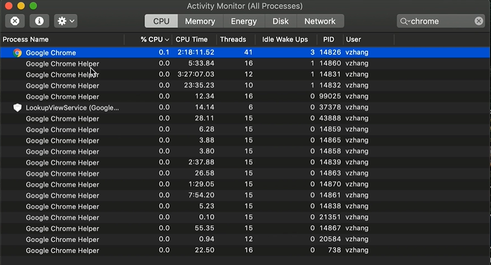
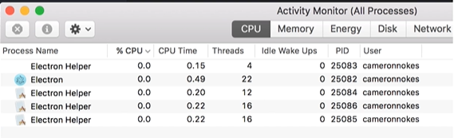
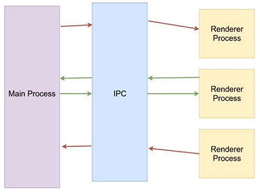
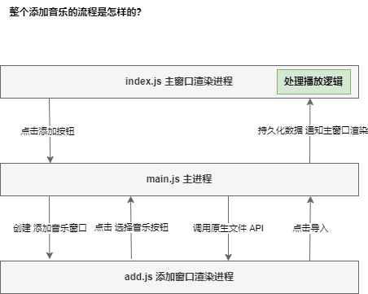
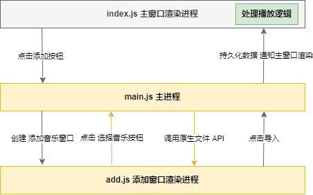
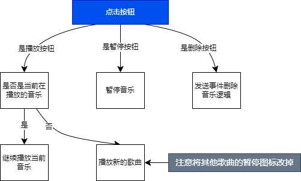

# 基于 Electron 的本地音乐播放器

## 第一章：进入 Electron 的世界

### 1-1 什么是 Electron

使用 Electron 开发一款本地音乐播放器

【1】什么是 Electron

> 使用 Javascript，HTML 和 CSS 构建跨平台的桌面应用

- Web 技术-Electron 基于 Chromium 和 Node.js（增强版的 chromium 浏览器）
- 开源 - 众多贡献者组成的活跃社区共同维护的开源项目。（bug 很快的修复）
- 跨平台 - 兼容 Mac，Windows 和 Linux（解决跨平台的问题）

【2】谁在使用 Electron

> [Electron 首页 - Apps users love, built with Electron](https://www.electronjs.org/zh/)

- Skype
- GitHub
- Desktop
- Flgma
- Visual Studio Code
- Kitematic
- Slack
- Atom

国内：

- Teambition 钉钉项目
- WeChat 桌面端

【3】我们能学到什么

- **夯实前端开发基础** - HTML，JS，CSS
- 深入浅出**学习 Node.js**
- 深入理解**浏览器工作原理**
- Electron API 应用（点开技能树，开发桌面应用）

【4】演示简单的 demo

- simple-music-player

功能：

- 添加音乐：多选
- 播放
- 暂停
- 删除歌曲

【5】基础知识

- HTML，JS，CSS 的基础知识
- Node.js 的最基本知识

（完）

### 1-2 配置开发环境

#### 【1】环境需求

[1]Node.js > 8.0.0

```bash
node -v # node --version
# v8.15.1
```

[2]node 版本管理工具

```bash
nvm ls
```

[3]git 版本管理工具

```bash
git --version
# git version 2.37.0.windows.1
```

#### 【2】chrome 官方的 repository

- npm install 要下载一个 chromium 的浏览器内核，大约 50 多兆，两分多钟。

```bash
# Clone this repository
git clone https://github.com/electron/electron-quick-start
# Go into the repository
cd electron-quick-start
# Install dependencies
npm install
# Run the app
npm start
```

#### 【3】electron-quick-start 项目内容

> 结构简单；  
> 除了 `package.json`，其他 先不说。
>
> - index.html
> - mian.js
> - renderer.js
> - package.json

##### [1]package.json

> package.json

```json
{
  "name": "electron-quick-start",
  "version": "1.0.0",
  "description": "A minimal Electron application",
  "main": "main.js",
  "scripts": {
    // 对应的入口：
    // ① 运行这个命令 electron
    // ② . - 点代表当前的目录
    "start": "electron ."
  },
  "repository": "https://github.com/electron/electron-quick-start",
  "keywords": ["Electron", "quick", "start", "tutorial", "demo"],
  "author": "GitHub",
  "license": "CC0-1.0",
  "devDependencies": {
    // electron - 可运行的命令行工具
    "electron": "^31.2.1"
  }
}
```

##### [2]Hello World 应用成功启动，展示效果：

展示环境参数：

- Nodejs 版本
- Chromium 版本
- Electron 版本

```md
Hello World!
We are using Node.js 20.15.0, Chromium 126.0.6478.127, and Electron 31.2.1.
```

##### [3] 展示页面代码 index.html

> index.html

```html
<!DOCTYPE html>
<html>
  <head>
    <meta charset="UTF-8" />
    <title>Hello World!</title>
  </head>
  <body>
    <h1>Hello World!</h1>
    We are using Node.js <span id="node-version"></span>, Chromium
    <span id="chrome-version"></span>, and Electron
    <span id="electron-version"></span>.

    <!-- You can also require other files to run in this process -->
    <script src="./renderer.js"></script>
  </body>
</html>
```

（完）

## 第 2 章 第一个 Electron 应用

### 2-1 主进程和渲染进程 ⭐

【1】什么是 Process-进程？

（正在被执行或运行的计算机程序）

- An instance of a computer program that is being executed - 维基百科

【2】用 Chromium 来举例

- 一个 Main Process，类似任务管理器里的 Google Chrome 主进程和 Google Chrome Helper



【3】Electron 的资源管理器



Chromium 和 Electron 一样，运行产生多个进程。

【4】主进程和渲染进程的异同和特点：

[4.1]主进程-Main Process 的特点

- ◆ 可以使用和系统对接的 Electron API - 创建菜单，上传文件 等等
- ◆ 创建 渲染进程 - Renderer Process
- ◆ 全面支持 Node.js
- ◆ 只有一个，作为整个程序的入口点

[4.2]渲染进程-Renderer Process 的特点

> 帮助理解：
>
> - Chrome 浏览器整体是一个 Main Process，每个 Tab 是一个 Renderer Process，它们是相互独立的，是被 Main Process 所控制的。

- ◆ 可以有多个，每个对应一个窗口
- ◆ 每个都是一个单独的进程
- ◆ 全面支持 Node.js 和 DOM API
- ◆ 可以使用一部分 Electron 提供的 API

【5】对比回归 electron-quick-start 项目

> 演示项目时只有一个窗口，说明只有一个渲染进程，和文件一致。

- main.js 代表 主进程
- renderer.js 代表 渲染进程

### 2-2 创建 browserWindow

> 1. 熟悉 API：学会 BrowserWindow 的用法；
> 2. 加深了解主进程和渲染进程的运行机制；

#### package.json

> package.json

```json
{
  "name": "electron-quick-start",
  "version": "1.0.0",
  "description": "A minimal Electron application",
  "main": "main.js", // 主入口、主进程
  "scripts": {
    "start": "electron ." // 入口命令
  },
  "repository": "https://github.com/electron/electron-quick-start",
  "keywords": ["Electron", "quick", "start", "tutorial", "demo"],
  "author": "GitHub",
  "license": "CC0-1.0",
  "devDependencies": {
    "electron": "^31.2.1"
  }
}
```

#### 【1】使用 nodemon 监听文件变化

- 每次 main.js 修改后，都要关闭当前窗口，重启。
- 所以需要辅助工具 nodemon，监控文件变化，然后自动运行相应的命令，省去了手动操作的过程。

##### [1]安装 nodemon

> electron-quick-start

```bash
cd electron-quick-start
npm install nodemon --save-dev
```

##### [2]package.json 修改启动：

```diff
  "scripts": {
-     "start": "electron ." // 入口命令
+     "start": "nodemon --watch main.js --exec electron ." // 入口命令
  },
```

#### 【2】BrowserWindow 创建窗口

##### [1]Main Process

- 只有**主进程有权利创建 BrowserWindow！**
- 了解更多 BrowserWindow，参考官方文档：[Electron-DOC-API - BrowserWindow](https://www.electronjs.org/zh/docs/latest/api/browser-window)

> main.js

```js
// 首先加载两个模块
const { app, BrowserWindow } = require("electron");

// ready 事件：
// electron 已经完全加载，准备好开始创建 BrowserWindow 的时候，会调用这个事件；
// 有一些 API 只有在这个事件成功后，才可运行。
app.on("ready", () => {
  // 创建第一个窗口
  // - 主 window new 实例化一个 BrowserWindow，传入一些参数，在 obj 里。
  const mainWindow = new BrowserWindow({
    width: 800, // 宽
    height: 600, // 高
    webPreferences: {
      nodeIntegration: true, // 在 mainWindow 的 renderer process 里可以使用 node API
      contextIsolation: false, // - [原则上 renderer.js 里 不能使用 node API](https://coding.imooc.com/learn/questiondetail/380V9YvyzZjP4Nxw.html)
    }, // 现在已经自动创建了窗口
  });
  mainWindow.loadFile("index.html");

  // 创建第二个窗口
  const secondWindow = new BrowserWindow({
    width: 400,
    height: 300,
    webPreferences: {
      nodeIntegration: true,
      contextIsolation: false,
    },
    parent: mainWindow, // 附属于父窗口，父窗口关闭，子窗口也关闭。
  });
  secondWindow.loadFile("second.html");
});
```

##### [2]Renderer Process

> 不仅可以使用 DOM API，也可以使用 Node.js APIs

[2.1]注意配置以启用 Node.js APIs：⭐

- `nodeIntegration` 为 `true`，
- `contextIsolation` 为 `false`

```diff
    webPreferences: {
       nodeIntegration: true,
+       contextIsolation: false,
    },
```

[2.2]测试 Nodejs 和 DOM API

1）访问 Node.js APIs：

- 注意要配置 contextIsolation 为 false
- [原则上 renderer.js 里 不能使用 node API](https://coding.imooc.com/learn/questiondetail/380V9YvyzZjP4Nxw.html)

```js
alert(process.versions.node);
```

2）访问 DOM APIs：

```js
window.addEventListener("DOMContentLoaded", () => {
  alert("greeting from the DOM side");
});
```

[2.3]renderer 代码：

> renderer.js

```js
/**
 * This file is loaded via the <script> tag in the index.html file and will
 * be executed in the renderer process for that window. No Node.js APIs are
 * available in this process because `nodeIntegration` is turned off and
 * `contextIsolation` is turned on. Use the contextBridge API in `preload.js`
 * to expose Node.js functionality from the main process.
 */
// 1）访问 Node.js APIs：
alert(process.versions.node);
// 2）访问 DOM APIs：
window.addEventListener("DOMContentLoaded", () => {
  alert("greeting from the DOM side");
});
```

### 2-3 进程间通信

> 本节：
>
> - `ipcRenderer`、`ipcMain` 以事件方式进行通信。
> - 代码实现较简单。

#### 【1】概念

##### [1]前面讲了：

- BrowserWindow 创建了窗口；
- 主进程和渲染进程之间的关系；

##### [2]进程之间的通讯方式 ⭐

- Electron 使用 IPC（interprocess communication）在进程之间进行通讯【通信桥梁】
- 和 Chromium 完全一致【运行方式】

##### [3]解释：

而**进程**是一个**正在被执行**的**应用程序**；

> 它们之间的通信，如 PPT 能否知道正在播放哪首歌？

1. 操作系统提供了程序之间通信的桥梁 IPC —— 把程序（小岛-有各自运行机制、内存的分配）连接起来；
2. IPC 的全称是 interprocess communication；
3. Electron 和 Chromium 的运行方式完全一致
4. 不需要了解 IPC 在操作系统级别是怎样工作的，只需要了解 Electron 给我们提供了相应的 API，可以帮助我们完成进程之间的通信即可。

##### [4]为什么要在进程之间通信？（每个进程在小岛上为什么要沟通？）



Main Process 有操作某些特定 API 的能力，在主进程完成某些操作时，需要通知 Renderer Process 进行对应的操作，比如界面更新；

同时，渲染进程完成一些界面操作时，比如页面点击某个按钮，需要调用主进程某些特定的 API，这时也需要通过事件的方式完成对应的通知效果；

Electron 的进程通信方式和我们非常熟悉的 DOM 事件机制是一样的，都是 Event Driven 事件驱动的；

所以有很多事件很亲切，其实主要使用 Electron 的两个模块，就是基于 Nodejs Event Immediate 实例的，就像图中描述的沟通方式一样，通过红色箭头通过 IPC 进行沟通。

Renderer Process 可以通过某种方式通过 IPC 给 Main Process 发送消息。

#### 【2】实战步骤

[1]启动 npm start，删除 main 的第二个 window，并删除 renderer 的无用代码。

[2]消息发送：

- 加载 electron 的原生模块 **ipcRenderer**，并通过 **send 发送消息**；

步骤：

1. 加载模块 `ipcRenderer`
2. 向 IPC 发送事件

> renderer.js

```js
// 1. 加载模块 ipcRenderer
const { ipcRenderer } = require("electron");

window.addEventListener("DOMContentLoaded", () => {
  // 2. 向 IPC 发送事件
  ipcRenderer.send("message", "hello from renderer"); // 可以发送任何类型的数据格式。
});
```

[3]其中，Event Driven 有 Sender 发送者，也有接收者，接收者接收事件需要监听这个事件（跟 DOM 上的事件基础一样）。

[4]引入 **ipcMain** —— 在 Main Process 上运行的 ipc 的模块，并通过 **on 接收消息**；

1. 加载主进程上运行的 ipc 模块 `ipcMain`。

2. 接收两个参数：  
   `event`-发送的事件对象，  
   `arg`-发送的事件内容。

3. 可看到 cmd 打印出了：`hello from renderer`

说明消息从 Renderer Process 发送到了 Main Process。

```diff
- const { app, BrowserWindow } = require("electron");
+ // 1. 加载主进程上运行的 ipc 模块 ipcMain
+ const { app, BrowserWindow, ipcMain } = require("electron");

app.on("ready", () => {
...

+   ipcMain.on("message", (event, arg) => {
+     // 2. 接收两个参数：
+     //  `event`-发送的事件对象，
+     //  `arg`-发送的事件内容。
+     // 3. 可看到 cmd 打印出了：`hello from renderer`
+     // 说明消息从 Renderer Process 发送到了 Main Process。
+     console.log(arg);

...

+   });
});
```

[5]消息回复 `event.sender.send`：（Main -> Renderer）

- event 是复杂对象，里有一个 sender 是发送者，调用发送者的 send 方法，可以从 Main Process 把消息 reply 回复给 Renderer Process。

```diff
...

  ipcMain.on("message", (event, arg) => {

...

+     event.sender.send("reply", "hello from main");

  });
...
```

[6]监听来自 Main Process 的消息

- 同样，`ipcRenderer` 有一个事件监听：
- 使用 `on` 监听 `reply`，得到回复的消息，
- 也有两个参数 `event` 和 `arg`。

> renderer.js

```diff
+   // 监听来自 Main Process 的消息。
+   ipcRenderer.on("reply", (event, arg) => {

...

+   });
```

[7]接收的来自 Main 的消息，希望在页面上做一些处理，打印出来；

- 在页面上添加一个 `p#message` 标签，填充上 Main Process 发送过来的内容。

> index.html

```diff
+     <p id="message"></p>
```

[8]把接收到的消息 message，通过 DOM 操作到页面上。

> renderer.js

```diff
+     document.getElementById("message").innerHTML = arg;
```

[9]回复信息的两种方式 —— `event.sender` 等于 `mainWindow`：

1. 除了通过 event.sender 发送信息，
2. 也可以通过 mainWindow 发送信息：

```diff
+     // 回复信息的两种方式 —— `event.sender` 等于 `mainWindow`：
+     // event.sender.send("reply", "hello from main");
+     mainWindow.send("reply", "hello from main");
```

#### 【3】所有代码：

##### [1]主进程

> main.js

```js
// 首先加载两个模块
// 1. 加载主进程上运行的 ipc 模块 ipcMain
const { app, BrowserWindow, ipcMain } = require("electron");

// ready 事件：
// electron 已经完全加载，准备好开始创建 BrowserWindow 的时候，会调用这个事件；
// 有一些 API 只有在这个事件成功后，才可运行。
app.on("ready", () => {
  // 创建第一个窗口
  // - 主 window new 实例化一个 BrowserWindow，传入一些参数，在 obj 里。
  const mainWindow = new BrowserWindow({
    width: 800, // 宽
    height: 600, // 高
    webPreferences: {
      nodeIntegration: true, // 在 mainWindow 的 renderer process 里可以使用 node API
      contextIsolation: false, // - [原则上 renderer.js 里 不能使用 node API](https://coding.imooc.com/learn/questiondetail/380V9YvyzZjP4Nxw.html)
    }, // 现在已经自动创建了窗口
  });
  mainWindow.loadFile("index.html");

  ipcMain.on("message", (event, arg) => {
    // 2. 接收两个参数：
    //  `event`-发送的事件对象，
    //  `arg`-发送的事件内容。
    // 3. 可看到 cmd 打印出了：`hello from renderer`
    // 说明消息从 Renderer Process 发送到了 Main Process。
    console.log(arg);
    // 回复信息的两种方式 —— `event.sender` 等于 `mainWindow`：
    // event.sender.send("reply", "hello from main");
    mainWindow.send("reply", "hello from main");
  });
});
```

##### [2]渲染进程

> renderer.js

```js
// 1. 加载模块 ipcRenderer
const { ipcRenderer } = require("electron");

window.addEventListener("DOMContentLoaded", () => {
  // 2. 向 IPC 发送事件
  ipcRenderer.send("message", "hello from renderer"); // 可以发送任何类型的数据格式。
  // 监听来自 Main Process 的消息
  ipcRenderer.on("reply", (event, arg) => {
    // 把接收到的消息 message，通过 DOM 操作到页面上。
    document.getElementById("message").innerHTML = arg;
  });
});
```

##### [3]页面

> index.html

```html
<!DOCTYPE html>
<html>
  <head>
    <meta charset="UTF-8" />
    <title>Hello World!</title>
  </head>
  <body>
    <h1>Hello World!</h1>
    <p id="message"></p>
    <script>
      // 可以使用 nodejs 的方式
      require("./renderer.js");
    </script>
  </body>
</html>
```

（完）

## 第 3 章 播放器应用的演示与分析

### 3-1 从原型图出发

> 分析原型图（线框图）
>
> - 要做几个窗口，
> - 粗略分析功能点。

【1】粗略分析页面：

[1]主窗口

1. 展示添加曲目
2. 点击播放，下面显示播放信息、总时间和已经播放的时间、进度条
3. 添加歌曲到曲库的按钮

[2]添加音乐到曲库的窗口：

1. 选择音乐：浏览本地音乐文件
2. 展示选择的音乐
3. 导入音乐：把选择的音乐导入当前的曲库

【2】详细分析页面功能点（产品经理-需求）：

[1]主窗口

1. 添加歌曲到曲库 -> 打开窗口（理解 Electron 进程的运行机制）；

2. ① click 播放按钮 - 播放音乐；  
   ② 再次 click 按钮 - 暂停音乐；  
   ③ 点击播放同时的播放区域，展示歌曲名称、时间、进度等信息；

3. 点击垃圾桶删除按钮，删除歌曲。

[2]添加窗口

1. 点击选择音乐按钮，弹出电脑原生文件窗口（类似上传文件一样，选择对应的文件）；
2. 以列表的形式展示在页面上；
3. 点击导入音乐，关闭窗口并且把选择的音乐添加到主窗口上面。

### 3-2 功能流程和文件结构

> 本节：
>
> - 从代码级别，讲解整个功能的流程和逻辑，并且创建对应的文件结构。
> - 使用流程图，非常直观理解多个进程之间怎样交流和通信的。

#### 【1】功能流程



#### 【2】分析

[1]3 个进程，2 个窗口（主窗口、添加音乐窗口），中枢神经 主进程 Main Process main.js

[2]**添加音乐的整个流程**是怎样的？

① 点击添加歌曲到曲库：

- 主窗口的渲染进程开始，添加按钮，到 main.js 主进程

- （主进程才有 Electron 特有的一些 API，比如创建窗口）

- 主进程创建添加音乐窗口。

② 点击选择音乐，又请求到了主进程，

- 主进程才会有调用原生文件 API 的能力；
- 弹窗口，选歌曲；

③ 把要添加的歌曲信息返回给 添加窗口渲染进程，接到消息 ok，展示到列表；

④ 点击导入音乐，把信息传送到主进程

- 主进程存在一个库，帮我们持久化数据  
  （把音乐数据放到本地文件也好，或者数据库，把数据持久化下来），然后通知主窗口渲染；
- 处理播放逻辑，在主窗口的渲染进程上进行处理  
  （html 有 audio 对象，使用对象播放音乐，监控进度等一系列功能。）

#### 【3】项目操作

[1]创建项目 `simple-music-player`

> 详情，见文档：[Electron 官网 - 开始上手 - 快速入门 - 创建你的应用程序](https://www.electronjs.org/zh/docs/latest/tutorial/quick-start#%E5%88%9B%E5%BB%BA%E4%BD%A0%E7%9A%84%E5%BA%94%E7%94%A8%E7%A8%8B%E5%BA%8F)

[1.1]Bash：

```bash
# 初始化
mkdir simple-music-player && cd simple-music-player
npm init

# 安装开发依赖 electron
npm install --save-dev electron

# 启动项目
npm start
```

[1.2]增加 start 命令执行 Electron

> package.json

```json
{
  "name": "simple-music-player",
  "version": "1.0.0",
  "description": "",
  "main": "main.js",
  "scripts": {
    "start": "electron ."
  },
  "author": "",
  "license": "MIT",
  "devDependencies": {
    "electron": "^31.2.1"
  }
}
```

[1.3]安装 nodemon 并修改 start，监听文件变化：

```json
  "scripts": {
    "start": "nodemon --watch main.js --exec electron ."
  },
```

[2]UI：

- 安装 bootstrap

```bash
cd simple-music-player
npm install bootstrap --save
```

[3]JS：

- 使用原生 js，不使用框架。

[4]renderer 视图页面渲染层级：

创建 4 个文件：

- 主窗口：renderer/index.js
- 主窗口：renderer/index.html
- 添加窗口：renderer/add.js
- 添加窗口：renderer/add.html

## 第 4 章 播放器应用之添加音乐窗口

### 4-1 从首页样式开始

### 4-2 创建添加音乐窗口

面试题：

- 获取 id 的 addEventListener() 添加的 dom 事件和 直接 button 标签里 onClick 有什么区别？

本节-掌握：

1. index.html 的 script 里使用 node.js

2. 巩固 Renderer Process 通过 ipcRenderer 给 Main Process 发送信息的过程。

下节-优化代码：

- 创建 window 窗口每次都要写一大堆代码，
- 希望通过创建一个 class 类帮我们管理 BrowserWindow 对象，
- 用一行代码实现创建新的 window。

### 4-3 创建窗口类

> 优化代码：
>
> 1. AppWindow extends BrowserWindow
> 2. BrowserWindow

【1】管理 BrowserWindow 对象

[1]AppWindow 类

> main.js

```js
class AppWindow extends BrowserWindow {
  constructor(config, fileLocation) {
    const basicConfig = {
      width: 800,
      height: 600,
      webPreferences: {
        // // 为了访问渲染器中的Node.js的某些功能，我们在 BrowserWindow 的构造函数上附加了一个预加载脚本。
        //   preload: path.join(__dirname, "preload.js"),
        nodeIntegration: true,
        contextIsolation: false,
      },
    };
    // const finalConfig = Object.assign(basicConfig, config);
    const finalConfig = { ...basicConfig, ...config };
    super(finalConfig);

    // 加载 index.html
    this.loadFile(fileLocation);
  }
}
```

[2]使用

```diff
+ const mainWindow = new AppWindow({}, "./renderer/index.html");

...

+     const addWindow = new AppWindow(
+       {
+         width: 500,
+         height: 400,
+         parent: mainWindow,
+       },
+       "./renderer/add.html"
+     );
```

【2】优雅的显示窗口
[1]文档：

- [Electron 文档 - API - Main Process 模块 - BrowserWindow - 优雅地显示窗口](https://www.electronjs.org/zh/docs/latest/api/browser-window#%E4%BC%98%E9%9B%85%E5%9C%B0%E6%98%BE%E7%A4%BA%E7%AA%97%E5%8F%A3)

[2]代码

```diff
+       show: false

+     // 优雅地显示窗口
+     this.once("ready-to-show", () => {
+       this.show();
+     });
```

[3]展示效果的区别：

- 没有这段代码，展示效果先空白后再展示按钮，比较突兀。
- 加上这段代码，直接展示一个完整不间断的页面效果，用户体验较好。

【3】总结

完成了代码的重构。

- 其实代码的重构，不一定是在项目全部完成，才考虑重构，重构可以是实时发生的。

### 4-4 使用 Dialog 模块添加音乐文件

> dialog API 实现文件选择
>
> - [Electron - API - dialog](https://www.electronjs.org/zh/docs/latest/api/dialog)
> - 创建操作系统原生的动画框，并且同它进行交互。

【1】先看原型图

现在做黄色区域的功能：



【2】代码

- [dialog.showOpenDialog([browserWindow, ]options)](https://www.electronjs.org/zh/docs/latest/api/dialog#dialogshowopendialogbrowserwindow-options)

看文档

- 和老师讲解的，文档不一样，dialog.showOpenDialog().then()，通过 then 获取结果。

### 4-5 展示添加的文件列表

#### 【1】本节原理：

添加的消息发送到添加窗口，即上图中的：

- 由 main.js 主进程**调用原生文件 API** 到 add.js 添加窗口渲染进程

#### 【2】注意（实践中的坑！）：

1. `event.sender.send` 在 Electron 新版本 `v31.2.1` 中不可再作为主进程回复给渲染进程的方法，**而是使用 `event.reply` 方法**；
2. 新方法见文档：[Electron - 文档 - Electron 中的流程 - 进程间通信 - 模式 2：渲染器进程到主进程（双向）​ - 使用 ipcRenderer.send](https://www.electronjs.org/zh/docs/latest/tutorial/ipc#%E4%BD%BF%E7%94%A8-ipcrenderersend)
3. `event.sender.send` 方法应该是版本 `v4.1.3` 时的方法。

#### 【3】代码：

##### [1]主进程

> main.js

```diff
-   ipcMain.on("open-music-file", () => {
+   ipcMain.on("open-music-file", (event) => {
    dialog
      .showOpenDialog({
        filters: [{ name: "Music", extensions: ["mp3"] }],
        properties: ["openFile", "multiSelections"],
      })
      .then((files) => {
-         console.log(files)
-         if(files) {
-           event.sender.send('selected-file', files)
+         if (files && files.filePaths) {
+           // 没有 event.sender.send 方法！
+           // event.sender.send("selected-file", files.filePaths);
+           event.reply("selected-file", files.filePaths);
+         }
      });
  });
};
```

##### [2]添加窗口

###### [2.1]add.html

> add.html

```diff
    <div class="container mt-4">
      <h1>添加音乐到曲库</h1>
+       <div id="musicList" class="mb-2">您还未选择任何音乐文件</div>

...
```

###### [2.2]add.js

> add.js

```diff
+ const path = require("path");

+ const renderListHTML = (pathes) => {
+   const musicList = $("musicList");
+   const musicItemsHTML = pathes.reduce((html, music) => {
+     html += `<li class="list-group-item">${path.basename(music)}</li>`;
+     return html;
+   }, "");
+   musicList.innerHTML = `<ul class="list-group">${musicItemsHTML}</ul>`;
+ };
+ // let musicFilesPath = [];
+ ipcRenderer.on("selected-file", (event, path) => {
+   if (Array.isArray(path)) {
+     renderListHTML(path);
+     // musicFilesPath = path;
+   }
+ });
```

###### [2.3]其中，Bootstrap 文档：

- [Bootstrap - Components - List group](https://v5.bootcss.com/docs/components/list-group/)

### 4-6 使用 Electron store 持久化数据

> 选择导入的数据，放入某个位置。
>
> - 运行官方 electron-store，并运行其小例子，
> - **store 数据**可以**储存、读取**，可以**存储在本地文件**里。

#### 【1】数据持久化的方式

- 使用数据库软件（mysql、mongdb）（简单应用安装数据库太重）
- 使用 HTML5 提供的浏览器对象（localStorage、sessionStorage、indexDB）（受限于浏览器可能出现过期时间等等问题）
- 使用本地文件（文件是个听起来很不错的解决方案；Electron 中可以使用 Nodejs API 自由的操作文件；文件的可移植性也非常好；自然而然这个方案是**最优选择**；基于文件的储存，持久化信息放到文件中储存到本地）

#### 【2】使用 electron-store

那么我们是否要使用 Nodejs API 的 FS 模块来完成文件的写入和读取呢？

- 完全不需要。我们可以使用 Electron 给我们提供的封装好的模块，它是一个单独的 repotory。
- 仓库地址：[`electron-store`](https://sindresorhus/electron-store)。

> You can use this module directly in both the main and renderer process.

##### [1]Install 安装

```bash
npm install electron-store --save
```

##### [2]Usage 使用（文档）

- 引入 `electron-store`，new 一个实例；
- set 设置内容
- get 获取数据
- 使用 dot `.` 这个符号，可以设置多层的数据结构。
- delete 删除数据

##### [3]遇到的问题

[1]方案一：

- [ ] 回退版本

不能使用 esm，本项目使用的 require 加载模块，但是 electron-store 要使用 import 等 esm 方式加载模块

- 现在考虑回退 electron-store 的版本。

- 还不行也回退 electron 的版本。

[2]方案二：

- [x] `await import()` 动态导入

CommonJS 模块中想使用 import 语法动态导入 ESM 模块，要通过 `await import('electron-store')` 方式导入；

因为在 Node.js 允许在 CommonJS 模块中使用 `await import()` 进行动态导入，这样支持的好处就是：可以在现有的 CommonJS 代码库中逐步引入 ESM 模块。

##### [4]代码

> main.js

```js
// import Store from "electron-store";
(async () => {
  const { default: Store } = await import("electron-store");
  // const Store = require('electron-store')

  const store = new Store();
  console.log(app.getPath("userData")); // C:\Users\xxx\AppData\Roaming\simple-music-player
  store.set("unicorn", "🦄");
  console.log(store.get("unicorn"));
  //=> '🦄'

  // Use dot-notation to access nested properties
  store.set("foo.bar", true);
  console.log(store.get("foo"));
  // => {bar: true}

  store.delete("unicorn");
  console.log(store.get("unicorn"));
  // => undefined
})();
```

#### 【3】运行项目，查看存储

- 上面 `app.getPath("userData")` 的打印的路径下，确实存在 `config.json` 文件，存储了 store 的数据。

foo.bar 被持久化到了文件中。

```json
{
  "foo": {
    "bar": true
  }
}
```

### 4-7 音乐持久化存储类

> 本节：
>
> - 定制 electron-store，为音乐文件所服务的曲库、数据库。

封装自己的 music-store，实现音乐持久化。

选择的音乐文件的路径通过数组的方式，存到文件中即可。
每个音乐文件对应的路径之外，添加一些属性，辅助数据结构。

【1】安装 uuid

```bash
npm install uuid --save
```

【2】代码

> renderer/MusicDataStore.js

```js
const Store = require("electron-store");
const uuidv4 = require("uuid/v4");
const path = require("path");

class DataStore extends Store {
  constructor(settings) {
    super(settings);

    // 1.保存所有音乐文件的信息
    this.tracks = this.get("tracks") || [];
  }
  // 2.保存音乐文件的数据
  saveTracks() {
    this.set("tracks", this.tracks);
    return this;
  }
  // 3.获取音乐信息
  getTracks() {
    return this.get("tracks") || [];
  }
  /**
   * 4.功能：音乐信息/track信息添加到数据当中去
   * 步骤：
   *  1.先获得复杂的数据结构，
   *  2.通过 filter 去掉已经存在的获得一个新的数组，
   *  3.然后安插到 tracks 数组后面。
   * @param {*} tracks
   * @returns
   */
  addTracks(tracks) {
    // 5.除了path信息，还希望有其他信息
    // 6.obj 包括 id区分不同音乐 path pathname 去重-有相同文件不添加
    const tracksWithProps = tracks
      .map((track) => {
        return {
          id: uuidv4(), // 7.uuid 生成独一无二的 uuid
          path: track,
          fileName: path.basename(track), // 8.文件名，借助 nodejs 的 path 模块
        };
      })
      .filter((track) => {
        // 9.去重
        const currentTracksPath = this.getTracks().map((track) => track.path);
        return currentTracksPath.indexOf(track.path) < 0;
      });
    this.tracks = [...this.tracks, ...tracksWithProps]; // 10.原来的 tracks 和新的 tracks 就是新的曲库
    return this.saveTracks();
  }
}

// 11.最后导出
module.exports = DataStore;
```

### 4-8 使用存储类保存数据

> 使用上面的持久化类 `DataStore`。

#### 【0】分析

点击导入音乐，进行导入任务。

- 点击 button，给 dom 添加一个事件，事件中使用 ipcRenderer 发送一个事件到主进程，同时把已经添加好的音乐信息发送过去。主进程调用新建的类完成数据的持久化。

也就是上图中的右侧部分：

1. 点击导入到 main.js 主进程，然后完成持久化数据，
2. 同时发送一个事件到主窗口渲染进程 index.js，把更新后的数据传输给它，让他进行接下来的任务。

本节，只进行第 1 步。

#### 【1】使用动态导入 `electron-store` 的方法，改写 `class DataStore`：

##### [1]错误消息：

```js
App threw an error during load
TypeError: DataStore is not a constructor
    at Object.<anonymous> (D:\workspaces\Imooc\imooc_practice\electron_music_player_dev\simple-music-player\main.js:6:17)
    at Module._compile (node:internal/modules/cjs/loader:1373:14)
    at Module._extensions..js (node:internal/modules/cjs/loader:1432:10)
    at Module.load (node:internal/modules/cjs/loader:1215:32)
    at Module._load (node:internal/modules/cjs/loader:1031:12)
    at c._load (node:electron/js2c/node_init:2:17025)
    at cjsLoader (node:internal/modules/esm/translators:352:17)
    at ModuleWrap.<anonymous> (node:internal/modules/esm/translators:297:7)
    at ModuleJob.run (node:internal/modules/esm/module_job:222:25)
    at async ModuleLoader.import (node:internal/modules/esm/loader:316:24)
(node:69820) UnhandledPromiseRejectionWarning: Error [ERR_PACKAGE_PATH_NOT_EXPORTED]: Package subpath './v4' is not defined by "exports" in D:\workspaces\Imooc\imooc_practice\electron_music_player_dev\simple-music-player\node_modules\uuid\package.json
    at exportsNotFound (node:internal/modules/esm/resolve:304:10)
    at packageExportsResolve (node:internal/modules/esm/resolve:651:9)
    at resolveExports (node:internal/modules/cjs/loader:599:36)
    at Module._findPath (node:internal/modules/cjs/loader:676:31)
    at Module._resolveFilename (node:internal/modules/cjs/loader:1138:27)
    at s._resolveFilename (node:electron/js2c/browser_init:2:121098)
    at Module._load (node:internal/modules/cjs/loader:993:27)
    at c._load (node:electron/js2c/node_init:2:17025)
    at Module.require (node:internal/modules/cjs/loader:1240:19)
    at require (node:internal/modules/helpers:179:18)
(Use electron --trace-warnings ... to show where the warning was created)
(node:69820) UnhandledPromiseRejectionWarning: Unhandled promise rejection. This error originated either by throwing inside of an async function without a catch block, or by rejecting a promise which was not handled with .catch(). To terminate the node process on unhandled promise rejection, use the CLI flag --unhandled-rejections=strict (see https://nodejs.org/api/cli.html#cli_unhandled_rejections_mode). (rejection id: 1)
```

##### [2]错误原因：

1. DataStore is not a constructor：这是因为你在 MusicDataStore.js 文件中使用了动态导入，但是 module.exports 在异步函数中可能未被正确导出。
2. Package subpath './v4' is not defined by "exports"：这是因为 uuid/v4 的导入方式已被弃用。

#### 【2】改了之后还是存在错误：

```js
(node:50732) UnhandledPromiseRejectionWarning: TypeError: Cannot read private member #options from an object whose class did not declare it
    at DataStore.get (file:///D:/workspaces/Imooc/imooc_practice/electron_music_player_dev/simple-music-player/node_modules/conf/dist/source/index.js:115:18)
    at D:\workspaces\Imooc\imooc_practice\electron_music_player_dev\simple-music-player\renderer\MusicDataStore.js:14:26
(Use electron --trace-warnings ... to show where the warning was created)
(node:50732) UnhandledPromiseRejectionWarning: Unhandled promise rejection. This error originated either by throwing inside of an async function without a catch block, or by rejecting a promise which was not handled with .catch(). To terminate the node process on unhandled promise rejection, use the CLI flag --unhandled-rejections=strict (see https://nodejs.org/api/cli.html#cli_unhandled_rejections_mode). (rejection id: 1)
```

#### 【3】最终改动

```diff
- const Store = require("electron-store");
- const uuidv4 = require("uuid/v4");
+ const uuidv4 = require("uuid").v4;
const path = require("path");

- class DataStore extends Store {
+ class DataStore {
-   constructor(settings) {
+   constructor(store) {
+     (async () => {
+       // // 继承 Store
+       // const { default: Store } = await import("electron-store");
+       // Object.setPrototypeOf(this, new Store(settings));
+
+       this.store = store;

-     super(settings);
+       // super(settings);

-     // 1.保存所有音乐文件的信息
-     this.tracks = this.get("tracks") || [];
+       // 1.保存所有音乐文件的信息
+       this.tracks = this.store.get("tracks") || [];
+     })();
  }
  // 2.保存音乐文件的数据
  saveTracks() {
-     this.set("tracks", this.tracks);
+     this.store.set("tracks", this.tracks);
    return this;
  }
  // 3.获取音乐信息
  getTracks() {
-     return this.get("tracks") || [];
+     return this.store.get("tracks") || [];
  }

  ...
  addTracks(tracks) {
    ...
  }
}
+
+ // 11.创建 DataStore 实例的工厂函数
+ async function createDataStore(settings) {
+   const { default: Store } = await import('electron-store');
+   const store = new Store(settings);
+   return new DataStore(store);
+ }
+
+ module.exports = createDataStore;
```

#### 【4】还可以做一些优化，比如 musicFilesPath ，可以加一些校验等功能——锦上添花。

```js
$("add-music").addEventListener("click", () => {
  ipcRenderer.send("add-tracks", musicFilesPath);
});
```

#### 【5】代码

##### [1]MusicDataStore

> MusicDataStore.js

```js
const uuidv4 = require("uuid").v4;
const path = require("path");

class DataStore {
  constructor(store) {
    (async () => {
      // // 继承 Store
      // const { default: Store } = await import("electron-store");
      // Object.setPrototypeOf(this, new Store(settings));

      this.store = store;

      // super(settings);

      // 1.保存所有音乐文件的信息
      this.tracks = this.store.get("tracks") || [];
    })();
  }
  // 2.保存音乐文件的数据
  saveTracks() {
    this.store.set("tracks", this.tracks);
    return this;
  }
  // 3.获取音乐信息
  getTracks() {
    return this.store.get("tracks") || [];
  }
  /**
   * 4.功能：音乐信息/track信息添加到数据当中去
   * 步骤：
   *  1.先获得复杂的数据结构，
   *  2.通过 filter 去掉已经存在的获得一个新的数组，
   *  3.然后安插到 tracks 数组后面。
   * @param {*} tracks
   * @returns
   */
  addTracks(tracks) {
    // 5.除了path信息，还希望有其他信息
    // 6.obj 包括 id区分不同音乐 path pathname 去重-有相同文件不添加
    const tracksWithProps = tracks
      .map((track) => {
        return {
          id: uuidv4(), // 7.uuid 生成独一无二的 uuid
          path: track,
          fileName: path.basename(track), // 8.文件名，借助 nodejs 的 path 模块
        };
      })
      .filter((track) => {
        // 9.去重
        const currentTracksPath = this.getTracks().map((track) => track.path);
        return currentTracksPath.indexOf(track.path) < 0;
      });
    this.tracks = [...this.tracks, ...tracksWithProps]; // 10.原来的 tracks 和新的 tracks 就是新的曲库
    return this.saveTracks();
  }
}

// 11.创建 DataStore 实例的工厂函数
async function createDataStore(settings) {
  const { default: Store } = await import("electron-store");
  const store = new Store(settings);
  return new DataStore(store);
}

module.exports = createDataStore;
```

##### [2]add.html

> add.html

```diff
+         <button id="add-music" class="btn btn-primary mt-4" type="button">
+           导入音乐
+         </button>
```

##### [3]add.js

> add.js

```diff
...

+ let musicFilesPath = [];

...

+ $("add-music").addEventListener("click", () => {
+   ipcRenderer.send("add-tracks", musicFilesPath);
+ });

...

ipcRenderer.on("selected-file", (event, path) => {
  if (Array.isArray(path)) {
    renderListHTML(path);
+     musicFilesPath = path;
  }
});

...
```

##### [4]main.js

> main.js

```diff
- // import Store from "electron-store";
- (async () => {
-   const { default: Store } = await import("electron-store");
-   // const Store = require('electron-store')
-
-   const store = new Store();
-   console.log(app.getPath("userData")); // C:\Users\shiji\AppData\Roaming\simple-music-player
-   store.set("unicorn", "🦄");
-   console.log(store.get("unicorn"));
-   //=> '🦄'
-
-   // Use dot-notation to access nested properties
-   store.set("foo.bar", true);
-   console.log(store.get("foo"));
-   // => {bar: true}
-
-   store.delete("unicorn");
-   console.log(store.get("unicorn"));
-   // => undefined
- })();
+ const createDataStore = require("./renderer/MusicDataStore");

...

app.on("ready", () => {
...

+   (async () => {
+     const myStore = await createDataStore({ name: "Music Data" });
+     // console.log(myStore.getTracks());
+
+     ipcMain.on("add-tracks", (event, tracks) => {
+       const updatedTracks = myStore.addTracks(tracks).getTracks();
+       console.log(81, updatedTracks);
+     });
+   })();

...
});
```

## 第 5 章 播放器应用之播放器窗口

### 5-1 获取数据 渲染主窗口列表 概念

[1]两种情况渲染列表：

1. 导入音乐后，渲染我的播放器列表
2. 初始化页面，渲染我的播放器列表

[2]使用 Grid System。

[3]Flex Box

### 5-2 获取数据 渲染主窗口列表 编码部分

#### 【1】图标库：

- [Font Awesome](https://fontawesome.com.cn/)

> index.html

```diff
+     <link
+       rel="stylesheet"
+       href="https://cdnjs.cloudflare.com/ajax/libs/font-awesome/6.0.0-beta3/css/all.min.css"
+     />
  </head>

+       <div id="tracksList" class="mt-4"></div>
```

#### 【2】主进程：

1. `add-tracks` 添加音乐以后，把添加之后的 tracks 发送到 mainWindow 渲染：  
   `mainWindow.send("getTracks", updatedTracks);`

2. 使用 `did-finish-loash`，mainWindow 第一次渲染以后，自动触发事件去完成列表的渲染：  
   `mainWindow.webContents.on("did-finish-load", () => {...})`

> main.js

```diff
const createDataStore = require("./renderer/MusicDataStore");
+
+ let myStore; // 异步获取

...

  // Create the browser window.
  const mainWindow = new AppWindow({}, "./renderer/index.html");

+   mainWindow.webContents.on("did-finish-load", () => {
+     console.log("page did finish load");
+     mainWindow.send("getTracks", myStore.getTracks());
+   });

...

  (async () => {
+     // 异步导入的方式，存储在全局变量中。
-     const myStore = await createDataStore({ name: "Music Data" });
+     myStore = await createDataStore({ name: "Music Data" });
    // console.log(myStore.getTracks());

    ipcMain.on("add-tracks", (event, tracks) => {
+       // updatedTracks 更新以后的 tracks
      const updatedTracks = myStore.addTracks(tracks).getTracks();
-       console.log(81, updatedTracks);
+       mainWindow.send("getTracks", updatedTracks);
    });
  })();

...
```

#### 【3】主窗口 index.js

- 接收事件 `getTracks`，并渲染页面列表：

> index.js

```diff
+
+ const renderListHTML = (tracks) => {
+   const tracksList = $("tracksList");
+   const tracksListHTML = tracks.reduce((html, track) => {
+     html += `<li class="row music-track list-group-item d-flex justify-content-between align-items-center">
+       <div class="col-10">
+         <i class="fas fa-music me-2 text-secondary"></i>
+         <b>${track.fileName}</b>
+       </div>
+       <div class="col-2">
+         <i class="fas fa-play me-3"></i>
+         <i class="fas fa-trash-alt"></i>
+       </div>
+     </li>`;
+     return html;
+   }, "");
+   const emptyTrackHTML =
+     '<div class="alert alert-primary">还没有添加任何音乐</div>';
+   tracksList.innerHTML = tracks.length
+     ? `<ul class="list-group">${tracksListHTML}</ul>`
+     : emptyTrackHTML;
+ };
+ ipcRenderer.on("getTracks", (event, tracks) => {
+   console.log("receive tracks", tracks);
+   renderListHTML(tracks);
+ });
```

#### 【4】加上之前的 `nodemon` 启动项目

> package.json

```
    "start": "nodemon --watch main.js --exec electron ."
```

### 5-3 播放音乐难点分析

#### [1]`HTMLAudio` 标签

- 创建播放器，控制音乐播放
- [MDN - `<audio>`](https://developer.mozilla.org/en-US/docs/Web/HTML/Element/audio)
- [MDN - Web 开发技术/HTML（超文本标记语言）/HTML 元素参考/`<audio>`](https://developer.mozilla.org/zh-CN/docs/Web/HTML/Element/audio)

```html
<audio controls src="/media/examples/t-rex-roar.mp3"></audio>
```

#### [2]`HTMLAudioElement` 对象

- 功能实现：JS 方法控制音乐的播放和暂停，音量的控制等，还可以添加事件，数据加载触发事件。
- 优点：使用对象完成音乐播放，具有更高的可定制化，可以脱离 HTML 页面的表象。

```js
const horn = new Audio("car_horn.wav");
horn.play();
horn.pause();
horn.volume = 0.75;
horn.addEventListener("loadeddata", () => {
  let duration = horn.duration;
  // The duration variable now holds the duration (in seconds) of the audio clip
});
```

- 怎么知道要播放哪首歌，组成一个类似 ID 的信息在 DOM 上，点击播放，可以取得这样的信息，所以怎么在 DOM 上储存自定义的数据？

#### [3]DOM 存储自定义数据

- HTML 中使用 自定义 data 属性：`data-*` 来储存
- JS 中使用 HTMLelement 的 `dataset` 属性来读取

> [MDN - HTML syntax]()

```html
<article
  id="electric-cars"
  data-columns="3"
  data-index-number="12314"
  data-parent="cars"
>
  ...
</article>
```

- [MDN - JavaScript acess]()

```js
const article = document.querySelector("#electric-cars");

article.dataset.columns; // '3'
article.dataset.indexNumber; // '12314'
article.dataset.parent; // 'cars'
```

#### [4]事件冒泡与代理

> 音乐列表巨大，是否要在所有播放、删除按钮上都绑定 click 事件，这样会影响效率——经典面试题

- 使用事件冒泡机制来完成一种叫事件代理的方法，这种方法早在 jQuery 时候就盛行了。

- 根据事件绑定原理，假如在外层绑定事件（如 html），点击里面可以冒泡到外层元素，只要在 html 上完成一次绑定，然后判断点击的元素是什么，就可以完成同样的绑定多次的工作，这样就可以节省资源并且提高效率；

这就是事件的代理。

#### [5]总结

1. 音乐播放使用 HTMLAudioElement 对象，
2. 储存信息使用 CustomData 属性，然后使用 dataset 取出信息；
3. 绑定事件在外层绑定事件，用事件冒泡简化流程。

### 5-4 主窗口播放音乐代码（一）

#### 【1】优化样式：

> index.html

```diff
+     <link rel="stylesheet" href="./index.css"/>
```

> index.css

```css
#tracksList .col-2 .fas:hover {
  cursor: pointer;
}
#tracksList .col-2 .fas,
#tracksList .col-2 .fas::before {
  text-align: center;
  display: inline-block;
  width: 16px;
}
```

#### 【2】主窗口

1. 使用 Audio 对象
2. 使用 `data-*` 自定义属性，使用 dataset 获取自定义属性
3. 使用 `classList`操作 CSS 类（技巧），很多好用的方法 `remove()` `add()` `toggle()` `replace()`。  
   文档：[MDN - Web API - Element.classList](https://developer.mozilla.org/zh-CN/docs/Web/API/Element/classList)

> index.js

```js

let musicAudio = new Audio();
let allTracks;
let currentTrack;

...

-         <i class="fas fa-play me-3"></i>
+         <i class="fas fa-play me-3" data-id="${track.id}"></i>
-         <i class="fas fa-trash-alt"></i>
+         <i class="fas fa-trash-alt" data-id="${track.id}"></i>

...

+   allTracks = tracks;

...

$("tracksList").addEventListener("click", (event) => {
  event.preventDefault();
  const { dataset, classList } = event.target;
  const id = dataset && dataset.id;
  if (id && classList.contains("fa-play")) {
    // 开始播放音乐
    currentTrack = allTracks.find((track) => track.id === id);
    musicAudio.src = currentTrack.path;
    musicAudio.play();
    classList.replace("fa-play", "fa-pause");
  }
});
```

#### 【3】其他功能：

- 再次点击-暂停，
- 点击其他-播放，
- 点击删除-删除歌曲，等等。

### 5-5 主窗口播放音乐编码（二）

> 当一块代码的逻辑开始持续上升的时候，使用流程图和前期伪代码的方式，可以让我们的编码工作事半功倍；

#### 【1】先用**流程图**梳理代码思路：

> 现在演示如何处理这个问题：



#### 【2】然后编写**伪代码和注释**：

把所有的**逻辑化作伪代码和注释**，写在程序里，如下所示：

1. 播放按钮，点击一下是暂停，
2. 再点击一下，接着播放，而不是从头开始。
3. 所以要判断是否是当前在播放的音乐，是-继续播放当前音乐，否-播放新的歌曲。
4. 如果播放新的歌曲，旧的歌曲的图标，要重置到播放。

[2]遇到复杂流程，不妨使用流程图来梳理代码思路。

#### 【3】最后编写真实代码：

##### [1]主窗口：

> renderer/index.js

```diff
$("tracksList").addEventListener("click", (event) => {
  event.preventDefault();
  const { dataset, classList } = event.target;
  const id = dataset && dataset.id;
  if (id && classList.contains("fa-play")) {
    // 开始播放音乐
+     if (currentTrack && currentTrack.id === id) {
+       // 继续播放音乐
+       musicAudio.play();
+     } else {
+       // 播放新的歌曲，注意还原之前的图标
      currentTrack = allTracks.find((track) => track.id === id);
      musicAudio.src = currentTrack.path;
      musicAudio.play();
+       const resetIconElm = document.querySelector(".fa-pause");
+       if (resetIconElm) {
+         resetIconElm.classList.replace("fa-pause", "fa-play");
+       }
+     }
    classList.replace("fa-play", "fa-pause");
+   } else if (id && classList.contains("fa-pause")) {
+     // 处理暂停逻辑
+     musicAudio.pause();
+     classList.replace("fa-pause", "fa-play");
+   } else if (id && classList.contains("fa-trash-alt")) {
+     // 发送事件 删除这条音乐
+     ipcRenderer.send("delete-track", id);
+   }
});
```

##### [2]主进程

> main.js

```diff
+
+   ipcMain.on("delete-track", (event, id) => {
+     // store 中调用 deleteTrack 方法，然后 send 回去。
+     const updatedTracks = myStore.deleteTrack(id).getTracks();
+     mainWindow.send("getTracks", updatedTracks);
+   });
```

##### [3]音乐存储 Store：

> MusicDataStore.js

```diff
+   deleteTrack(deletedId) {
+     this.tracks = this.tracks.filter((item) => item.id !== deletedId);
+     return this.saveTracks();
+   }
```

### 5-6 添加音乐播放器状态（一）

> 音乐播放器——播放状态提示：
>
> - 播放曲目、播放时间、进度条

#### 【1】audio 上的两个事件：

1. loadedmetadata 事件在元数据（metadata）被加载完成后触发。  
   [MDN - HTMLMediaElement/GlobalEventHandlers.onloadedmetadata](https://developer.mozilla.org/zh-CN/docs/Web/API/HTMLMediaElement/loadedmetadata_event)  
   （媒体文件已经加载好）

2. 当 currentTime 更新时会触发 timeupdate 事件。  
   [MDN - HTMLMediaElement: timeupdate](https://developer.mozilla.org/zh-CN/docs/Web/API/HTMLMediaElement/timeupdate_event)  
   （播放时间改变，自动触发该事件）

#### 【2】代码

##### [1]新建 container

```html
<div class="container fixed-bottom">
  <hr />
  <div class="row my-2" id="player-status"></div>
</div>
```

##### [2]主窗口：音乐播放器——播放状态提示

> index.js

```js
/**
 *
 * @param {*} name 歌曲名称
 * @param {*} duration 歌曲长度
 */
const renderPlayerHTML = (name, duration) => {
  const player = $("player-status");
  const html = `<div class="col font-weight-bold">
                  正在播放：${name}
                </div>
                <div class="col">
                  <span id="current-seeker">00:00</span> / ${duration}
                </div>`;
  player.innerHTML = html;
};
const updateProgressHTML = (currentTime) => {
  const seeker = $("current-seeker");
  seeker.innerHTML = currentTime;
};

// ...

// 添加 loadedmetadata 事件： loadedmetadata 以后，渲染播放器的状态。
musicAudio.addEventListener("loadedmetadata", () => {
  // 渲染播放器状态
  renderPlayerHTML(currentTrack.fileName, musicAudio.duration);
});

musicAudio.addEventListener("timeupdate", () => {
  // 更新播放器状态
  updateProgressHTML(musicAudio.currentTime);
});
```

### 5-7 添加音乐播放器状态（二）

> 本节主要实现功能：
>
> 1. 时间显示正确的格式：秒转为 `MM:ss` 的格式，注意单数补齐数字 0
> 2. 显示正确的进度条

#### 【1】代码

##### [1]工具函数：转换持续时间

> renderer/helper.js

```js
/**
 * 转换持续时间
 * @param {number} time 秒
 * @returns 00:00 59:59
 */
exports.convertDuration = (time) => {
  // 计算分钟
  // ① 1.2 -> 1 ； 2.2 -> 2
  // ② 单数返回 '01'，多位数返回 '010'
  const minutes = "0" + Math.floor(time / 60);
  // 计算秒数 ① 单数返回 '01'，多位数返回 '010'
  const seconds = "0" + Math.floor(time - minutes * 60);
  // return minutes.substr(-2) + ":" + seconds.substr(-2);
  return minutes.slice(-2) + ":" + seconds.slice(-2); // 这里暂时不考虑 '0100' 时间很长的音乐
};
```

##### [2]主窗口

aria 暂且删掉，是 accessibly 的东西：

```diff
      <div
        class="progress"
        role="progressbar"
-         aria-label="Example with label"
-         aria-valuenow="25"
-         aria-valuemin="0"
-         aria-valuemax="100"
      >
        <div class="progress-bar" style="width: 25%">25%</div>
      </div>
```

> renderer/index.html

```diff
-       <div id="tracksList" class="mt-4"></div>
+       <div id="tracksList" class="mt-4 pb-5"></div>
    </div>
-     <div class="container fixed-bottom">
+     <div class="container fixed-bottom bg-white pb-4">
      <hr />
      <div class="row my-2" id="player-status"></div>
+       <div class="progress" role="progressbar">
+         <div class="progress-bar bg-success" id="player-progress" style="width: 0%">0%</div>
+       </div>
```

##### [3]主窗口的渲染进程

> renderer/index.js

```diff
- const { $ } = require("./helper.js");
+ const { $, convertDuration } = require("./helper.js");

...

/**
 *
 * @param {*} name 歌曲名称
 * @param {*} duration 歌曲长度
 */
const renderPlayerHTML = (name, duration) => {
  const player = $("player-status");
  const html = `<div class="col font-weight-bold">
                  正在播放：${name}
                </div>
                <div class="col">
-                   <span id="current-seeker">00:00</span> / ${duration}
+                   <span id="current-seeker">00:00</span> / ${convertDuration(
+                     duration
+                   )}
                </div>`;
  player.innerHTML = html;
};
- const updateProgressHTML = (currentTime) => {
+ const updateProgressHTML = (currentTime, duration) => {
+   // 计算 progress 是当前要解决的问题
+   const progress = Math.floor((currentTime / duration) * 100);
+   const bar = $("player-progress");
+   bar.innerHTML = progress + "%";
+   bar.style.width = progress + "%";
  const seeker = $("current-seeker");
-   seeker.innerHTML = currentTime;
+   seeker.innerHTML = convertDuration(currentTime);
};

...

musicAudio.addEventListener("timeupdate", () => {
  // 更新播放器状态
-   updateProgressHTML(musicAudio.currentTime);
+   updateProgressHTML(musicAudio.currentTime, musicAudio.duration);
});
```

#### 【2】还可以继续优化：

- 按进度条 点击播放位置 等。

## 第 6 章 应用打包与分发

### 6-1 安装 electron-builder

#### 【1】打包(packing)

把源代码转换成安装包的过程，称之为打包(packing)

#### 【2】Electron 打包方式

- ◆ 手动打包
- ◆ Electron packager
- ◆ [Electron builder](https://github.com/electron-userland/electron-builder)

#### 【3】安装 Electron builder

##### [1]Npm

```bash
npm install electron-builder --save-dev
```

##### [2]Yarn

> Yarn is strongly recommended instead of npm.

```bash
yarn add electron-builder --dev
```

### 6-2 添加 electron builder 配置文件

> mac: 操作系统级别定制化需求，
> dmg: Apple Disk Image
> 图标：
> dist/xxx.yaml/dmg/yml/zip/dmg.blockmap
> icns：Apple Icon Image format

#### 【1】文档：

- [Github - electron-builder/Documentation](https://github.com/electron-userland/electron-builder#documentation)
- [electron-builder](https://www.electron.build/)

#### 【2】配置文档

##### [1]macOS

- [electron-builder/Configuration/macOS/Any macOS Target](https://www.electron.build/configuration/mac)

##### [2]Windows

- [electron-builder/Configuration/Windows/Any Windows Target](https://www.electron.build/configuration/win)

#### 【3】配置文件 `package.json`

> package.json

```json
{
  "name": "simple-music-player",
  "version": "1.0.0",
  "description": "A minimal Electron application",
  "main": "main.js",
  "scripts": {
    "start": "nodemon --watch main.js --exec electron .",
    "dist": "build"
  },
  "build": {
    "appId": "simpleMusicPlayer",
    // 操作系统级别的定制化的需求 - macOS
    "mac": {
      // 软件安装后在什么分类下，Apple's documentation 确定的。
      // category String | “undefined” - The application category type, as shown in the Finder via View -> Arrange by Application Category when viewing the Applications directory.
      // For example, "category": "public.app-category.developer-tools" will set the application category to Developer Tools.
      "category": "public.app-category.productivity"
    },
    "dmg": {
      "background": "build/appdmg.png",
      // String | “undefined” - The path to application icon.
      "icon": "build/icon.icns",
      "iconSize": 100,
      "contents": [
        {
          "x": 380,
          "y": 280,
          "type": "link",
          "path": "/Applications"
        },
        {
          "x": 110,
          "y": 280,
          "type": "file"
        }
      ],
      "window": {
        "width": 500,
        "height": 500
      }
    },
    "linux": {
      // linux 下，打包成什么样的格式
      "target": ["AppImage", "deb"]
    },
    "win": {
      // windows 下，打包成什么样的格式
      "target": "squirrel",
      // 图标
      "icon": "build/icon.ico"
    }
  },
  "repository": "https://github.com/djsz3y/simple-music-player",
  "author": "",
  "license": "MIT",
  "devDependencies": {
    "electron": "^31.2.1",
    "nodemon": "^3.1.4"
  },
  "dependencies": {
    "bootstrap": "^5.3.3",
    "electron-store": "^10.0.0",
    "uuid": "^10.0.0"
  }
}
```

#### 【4】参考配置：⭐

- [Github/zulip-electron](https://github.com/zulip/zulip-electron/blob/master/package.json)

### 6-3 在 macOS 平台打包程序

#### 【1】首先确定一下 node 版本：

- 最好升级到 v8 以上，否则整个过程可能会失败。

```bash
node --version
# v20.12.1
```

#### 【2】配置文件

> 参考上面[6-2](#6-2-添加-electron-builder-配置文件)

> package.json

```diff
+   "description": "A minimal Electron application",

  ...

  "scripts": {
    "start": "nodemon --watch main.js --exec electron .",
-     "dist": "build"
+     "dist": "electron-builder"
  },

  ...

  "devDependencies": {
    "electron": "^31.2.1",
+     "electron-builder": "^24.13.3",
    "nodemon": "^3.1.4"
  },
```

#### 【3】注意事项

1. 先安装 `electron-builder`；
2. 配置文件 `package.json`；
3. `description` `author` 等必须有，看打包时的提示；
4. 运行 `npm run dist`，打包到 dist 文件夹；
5. 有时只运行 `electron-build` 命令，可能会有权限问题，发现删除 dist 文件夹后，又可以运行，所以产生了 [【4】删除 dist 后再打包](#4删除-dist-后再打包)。

#### 【4】删除 dist 后再打包

##### 法 Ⅰ：scripts 添加自定义脚本

[1]安装 rimraf：

```bash
npm install rimraf --save-dev
```

[2]更新 package.json 文件的 scripts 部分

```diff
{
  "scripts": {
    "start": "nodemon --watch main.js --exec electron .",
+     "clean": "rimraf dist",
-     "dist": "electron-builder"
+     "dist": "npm run clean && electron-builder"
  }
}
```

[3]运行 `npm run dist`：

```bash
npm run dist
```

##### 法 Ⅱ：Nodejs 脚本

[1]编写 Nodejs 脚本 build.js

> build/build.js

```js
const { exec } = require("child_process");
const rimraf = require("rimraf");

// 删除 dist 目录
rimraf.sync("dist");
console.log("dist directory deleted");

// 运行 electron-builder
exec("electron-builder", (error, stdout, stderr) => {
  if (error) {
    console.error(`exec error: ${error}`);
    return;
  }
  console.log(`electron-builder stdout: ${stdout}`);
  console.error(`electron-builder stderr: ${stderr}`);
  console.log("Build process completed");
});
```

[2]更新 package.json 文件的 scripts 部分

> package.json

```diff
{
  "scripts": {
    "start": "nodemon --watch main.js --exec electron .",
-     "clean": "rimraf dist",
-     "dist": "npm run clean && electron-builder"
+     "dist": "node build/build.js"
  }
}
```

[3]运行 `npm run dist`：

```bash
npm run dist
```

## 第 7 章 总结与展望

### 7-1 总结与展望

[1]Electron 知识回顾

- 基本概念，搭建本地开发环境
- 主进程和渲染进程，进程通信
- 原型图分析，分析基本功能点和文件结构

- 添加音乐窗口，添加本地文件，持久化保存数据
- 主播放器窗口，DOM 操作，Audio 对象对音频的操作
- 使用 Electron builder 完成应用打包

[2]进阶项目：在线文档客户端。

[3]Electron 进阶课程展望

- 深入 Electron 知识 - 自定义菜单，全局快捷键，原生通知 等等。
- React 16.8 作为 View 层 - 重点介绍 React Hooks
- 使用 Node.js 和 七牛云 SDK 完成文档持久化
